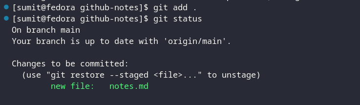

# github notes

## git commands

the following are the most common git commands

### git init

to initialize a new git repository at the current directory

```bash
git init
```
after running this command, a new directory named `.git` will be created at the current directory

### git add

after adding some files to the current directory, we can add them to the staging area by running the following command

```bash
git add .
```

<!-- add a screenshot -->



we can also add a specific file to the staging area by running the following command

```bash
git add <file>
```

we can also add multiple files to the staging area by running the following command

```bash
git add <file1> <file2> <file3>
```

if we want to remove a file from the staging area, we can run the following command

```bash
git rm --cached <file>
```

what is a stagin area?

In technical terms, the staging area is the middle ground between what you have done to your files (also known as the working directory) and what you had last committed (the HEAD commit). As the name implies, the staging area gives you space to prepare (stage) the changes that will be reflected on the next commit. This surely adds up some complexity to the process, but it also adds more flexibility to selectively prepare the commits as they can be modified several times in the staging area before committing.


### git commit

what is a commit?

A commit, or "revision", is an individual change to a file (or set of files). It's like when you save a file, except with Git, every time you save it creates a unique ID (a.k.a. the "SHA" or "hash") that allows you to keep record of what changes were made when and by who. Commits usually contain a commit message which is a brief description of what changes were made.

```bash
git commit -m "commit message"
```

commit message should be short and descriptive

there are some rules for writing a good commit message

1. Separate subject from body with a blank line
2. Limit the subject line to 50 characters
3. Capitalize the subject line
4. Do not end the subject line with a period
5. Use the imperative mood in the subject line
6. Wrap the body at 72 characters
7. Use the body to explain what and why vs. how

the commit message might vary depending on the project and the team

for example, if the project is using an issue tracker,

there might be some references to the issue tracker in the commit message

```bash
git commit -m "commit message #123"
```

there can be multiple references to the issue tracker in the commit message

```bash
git commit -m "commit message #123 #456"
```

multiple commit messages can be combined into a single commit message

```bash
git commit -m "commit message #123 #456" -m "commit message #789" -m "commit message #101112"
```


### git push

### git pull

### git clone

### git status

### git log

### git diff

### git branch

### git checkout

### git merge

### git reset

### git stash

### git rebase

### git tag

### git fetch

### git remote

### git show

### git config

### git rm

### git mv

### git grep

### gitk

### git instaweb

### git archive

### git fsck

